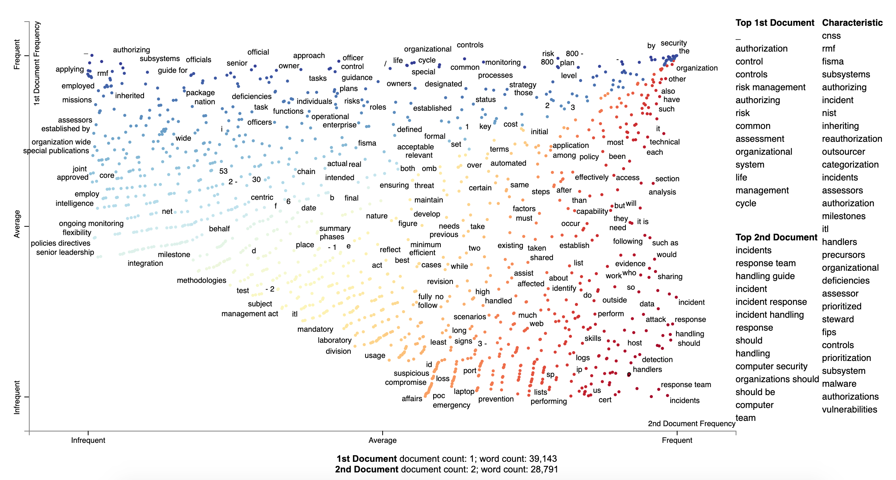

# LISPAT API

# Processing Pipeline 🔩

This page was created to describe pur process for analyzing documents, to summarize the content below; we begin by converting either a PDF or doc/docx document into a simple textfile. We then use the NLTK library to perform some text processing on the text data. Once we have extracted or removed particular features from the data we go ahead and find the most common keywords from each text so we can present this to the user. Finally we use the Scattertext library to create a graph visual representation of such data.

# Document Conversion 📑

**LISPAT** relies on converting traditional pdfs and docx documents into a simple text file. This is done through the use of the available **Docx** and **PDFminer** libraries in Python.

- PDF extraction is a complicated process due that their proprietary format, created by Adobe, they can contain links and buttons, form fields, audio, video, images, and business logic, making it difficult to extract text. We found through research that the _best_ library for this process is the **PDFminer** library, although this comes at the price of processing speed. Large documents can take a long time to convert to text and we still find that the extractions are not 100% accurate.

- Docx/Doc documents are a lot easier to work with and text extarction is easier and definetely faster, due to this, it is best to work with docx/doc documents. We must note there may still exist inaccuracies/inconsistencies when converting to text.

# Natural Language Processing 💬

With the help of **NLTK**, which is a leading platform for building Python programs to work with human language data, we can work with the now simple text data and extract important/valuable features. This process begins by first cleaning the data, which is done by tokenizing the text and removing:

- Punctuation
- Common names
- Stop words
- Integers
- Long words

The data can also be lemmatized and stemmed in order to get root words and remove what could be repetitive words. In this case we decided not to lemmatize the data as we might be losing some value by doing so.

Following this simple cleaning process we go through and find the most common keywords found in each text. We extract the words with the highest count of appearances in each text and create a list which is then cleaned. In this case we don't want to display to the users words that essentially have the same root. This is where we do our stemming.

# Visualization 📉

Once we have finished performing the converting and natural language processing we can then create a visual representation of the distinguishing terms found from each document, allowing for a pleasing representation of the data. To do this we use the **Scattertext** library, creating a dataframe of the datasets with their according labels and passing this to our visual processing which will create an HTML page to display the graph in.

This graph will list the top terms found in each document. The words found in the top left of the graph our terms that appear quite frequently in the 1st Document. the words found in the bottom right are words that appear quite frequently in the 2nd Document. Anything in the bottom left corner are infrequent words and the words in the top right corner are words that appear frequently in both documents.
